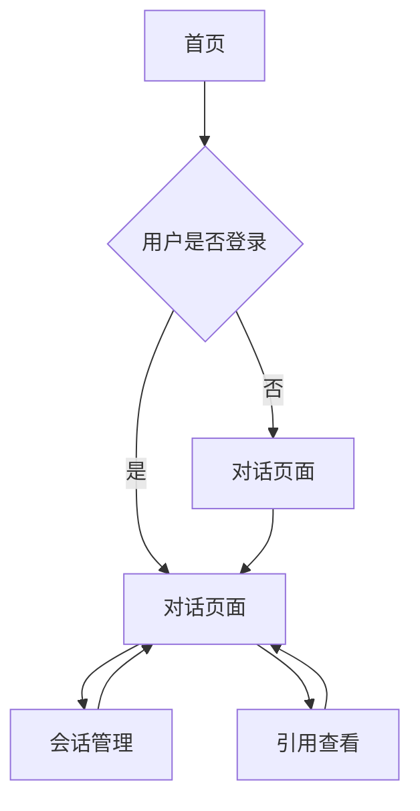

## 1. 产品概述
基于RAGFlow HTTP API开发的对话窗口型智能AI助手网站，为用户提供实时对话交互体验。支持文档出处引用、用户认证、会话管理等功能，同时预留广告位提供商业化服务。

## 2. 核心功能

### 2.1 用户角色
| 角色 | 注册方式 | 核心权限 |
|------|----------|----------|
| 访客用户 | 无需注册 | 可进行AI对话，会话不保存 |
| 注册用户 | 邮箱/手机号注册 | 可保存会话历史，管理个人资料 |

### 2.2 功能模块
AI助手网站包含以下核心页面：
1. **首页**: 欢迎界面、功能介绍、快速开始
2. **对话页面**: AI聊天窗口、消息展示、引用查看
3. **登录/注册页面**: 用户认证、账号管理
4. **会话管理页面**: 历史会话查看、会话管理

### 2.3 页面详情
| 页面名称 | 模块名称 | 功能描述 |
|----------|----------|----------|
| 首页 | Hero区域 | 展示网站logo、标题、简介，提供开始对话按钮 |
| 首页 | 功能介绍 | 介绍AI助手核心功能特性 |
| 首页 | 快速开始 | 提供快速进入对话的入口 |
| 对话页面 | 聊天窗口 | 实时显示用户与AI的对话消息，支持markdown渲染 |
| 对话页面 | 消息输入 | 支持文本输入、发送按钮，实时打字状态显示 |
| 对话页面 | 引用功能 | AI回答中的引用标记，点击弹出悬浮窗显示原文 |
| 对话页面 | 广告位 | 侧边栏或底部预留广告展示区域 |
| 登录页面 | 登录表单 | 支持邮箱/手机号登录，记住登录状态 |
| 注册页面 | 注册表单 | 邮箱验证、密码设置、用户协议 |
| 会话管理 | 会话列表 | 显示历史会话记录，支持搜索和删除 |
| 会话管理 | 会话详情 | 查看完整对话内容，支持导出 |

## 3. 核心流程

### 用户操作流程
1. **访客用户流程**: 访问首页 → 进入对话页面 → 与AI对话 → 会话结束（不保存）
2. **注册用户流程**: 注册/登录 → 进入对话页面 → 与AI对话 → 自动保存会话 → 查看历史会话
3. **引用查看流程**: AI回答显示引用标记 → 点击引用 → 弹出悬浮窗 → 显示原文并高亮

## 4. 用户界面设计

### 4.1 设计风格
- **主色调**: 参考logo的蓝色调，主色使用 #2563eb，辅色使用 #3b82f6
- **按钮样式**: 圆角矩形设计，主要按钮使用渐变蓝色
- **字体**: 中文使用PingFang SC，英文使用Inter，正文字号14-16px
- **布局风格**: 卡片式布局，左侧导航，右侧内容区域
- **图标风格**: 使用线性图标，保持简洁现代风格

### 4.2 页面设计概述
| 页面名称 | 模块名称 | UI元素 |
|----------|----------|---------|
| 首页 | Hero区域 | 居中对齐，大标题字体32px，蓝色渐变背景，醒目的开始按钮 |
| 对话页面 | 聊天窗口 | 类似微信的聊天气泡设计，用户消息右对齐蓝色，AI消息左对齐白色 |
| 对话页面 | 引用标记 | 上标数字样式，鼠标悬停显示手型光标 |
| 对话页面 | 悬浮窗 | 半透明遮罩层，居中显示原文卡片，支持关闭按钮 |
| 登录页面 | 登录表单 | 居中卡片布局，圆角边框，输入框有聚焦效果 |

### 4.3 响应式设计
- 采用桌面端优先设计，支持1920x1080标准分辨率
- 移动端适配：768px以下切换为移动布局，聊天窗口全屏显示
- 触摸优化：移动端增大按钮点击区域，支持滑动操作

### 4.4 广告位设计
- 对话页面右侧边栏预留300x250px标准广告位
- 支持图片和文字链广告，点击在新窗口打开
- 提供广告位管理接口，支持动态加载