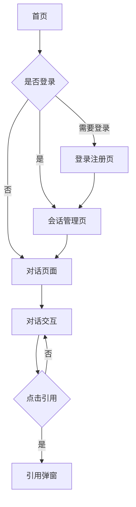

## 1. 产品概述

SolveX是一个基于RAGFlow HTTP API的智能对话助手网站，为用户提供专业的解决方案咨询服务。用户可以通过对话界面与AI助手进行实时交互，获得基于知识库的精准回答，并支持查看答案的出处引用。

该产品主要解决用户在日常工作和学习中遇到的专业问题，提供快速、准确、可追溯的解决方案，目标用户包括企业员工、学生、研究人员等需要专业咨询服务的群体。

## 2. 核心功能

### 2.1 用户角色

| 角色 | 注册方式 | 核心权限 |
|------|----------|----------|
| 访客用户 | 无需注册 | 可进行对话交互，无法保存会话历史 |
| 注册用户 | 邮箱注册 | 可保存会话历史，管理个人会话，查看使用记录 |

### 2.2 功能模块

SolveX对话助手网站包含以下主要页面：

1. **首页**：导航栏、Logo展示、快速开始对话入口、广告位
2. **对话页面**：对话窗口、消息展示、引用弹窗、实时输入、广告位
3. **登录注册页**：用户登录、注册表单、第三方登录
4. **会话管理页**：会话列表、新建会话、删除会话、搜索会话
5. **个人中心**：用户信息、使用统计、设置选项

### 2.3 页面详情

| 页面名称 | 模块名称 | 功能描述 |
|----------|----------|----------|
| 首页 | 导航栏 | 显示Logo、登录状态、快速导航链接 |
| 首页 | 英雄区域 | 展示产品标语、快速开始按钮、核心功能介绍 |
| 首页 | 广告位 | 预留横幅广告展示区域 |
| 对话页面 | 对话窗口 | 显示用户与AI的实时对话内容，支持markdown渲染 |
| 对话页面 | 输入区域 | 文本输入框、发送按钮、清空对话选项 |
| 对话页面 | 引用功能 | 点击引用符号弹出悬浮窗口，显示原文并高亮相关内容 |
| 对话页面 | 实时推送 | 使用SSE技术实现AI回复的实时流式输出 |
| 对话页面 | 侧边栏广告 | 预留侧边广告展示位 |
| 登录注册页 | 登录表单 | 邮箱密码登录、记住密码、忘记密码链接 |
| 登录注册页 | 注册表单 | 邮箱注册、密码确认、用户协议勾选 |
| 会话管理页 | 会话列表 | 显示所有会话记录、创建时间、最后消息预览 |
| 会话管理页 | 会话操作 | 新建会话、删除会话、重命名会话、搜索过滤 |
| 个人中心 | 用户信息 | 显示用户名、邮箱、注册时间 |
| 个人中心 | 使用统计 | 对话次数、使用时长、活跃天数 |
| 个人中心 | 设置选项 | 修改密码、通知设置、隐私设置 |

## 3. 核心流程

### 访客用户流程
访客用户可以直接在首页点击开始对话，进入对话页面与AI助手进行交互。对话内容仅在当前会话中保存，关闭页面后无法恢复历史记录。

### 注册用户流程
注册用户登录后可以享受完整功能，包括保存会话历史、管理多个对话会话、查看个人使用统计等。用户可以在会话管理页面创建新会话或继续之前的对话。

### 对话交互流程
1. 用户输入问题并发送
2. 系统调用RAGFlow API处理请求
3. AI助手返回带有引用的回答
4. 用户可点击引用查看原文出处
5. 对话内容实时更新并自动保存（注册用户）

## 4. 用户界面设计

### 4.1 设计风格
- **主色调**：深空蓝 (#1a365d) 作为品牌主色，搭配浅灰 (#f7fafc) 作为背景色
- **按钮样式**：圆角矩形设计，主要按钮使用渐变背景，次要按钮使用边框样式
- **字体选择**：中文使用思源黑体，英文使用Inter，正文字号14-16px，标题字号18-24px
- **布局风格**：卡片式布局，左右分栏设计，左侧对话区域，右侧辅助功能区域
- **图标风格**：使用线性图标，简洁现代，符合企业级产品定位

### 4.2 页面设计概述

| 页面名称 | 模块名称 | UI元素 |
|----------|----------|----------|
| 首页 | 导航栏 | Logo居中显示，右侧登录按钮，毛玻璃背景效果 |
| 首页 | 英雄区域 | 全屏渐变背景，大标题动画，醒目的开始按钮 |
| 对话页面 | 对话区域 | 消息气泡区分用户和AI，支持代码高亮，引用数字标识 |
| 对话页面 | 输入区域 | 底部固定输入框，支持多行文本，发送按钮带loading状态 |
| 对话页面 | 引用弹窗 | 半透明遮罩，居中弹窗，原文高亮显示，可关闭 |
| 会话管理 | 会话列表 | 卡片式布局，显示预览内容，悬停效果，操作按钮 |

### 4.3 响应式设计
采用桌面端优先的设计策略，确保在大屏幕上提供最佳体验。同时支持平板和手机端的自适应布局：
- 桌面端：左右分栏布局，完整功能展示
- 平板端：单栏布局，侧边栏可收起
- 手机端：底部导航，简化操作流程

### 4.4 广告位设计
- **横幅广告**：首页顶部和对话页顶部，支持图片和文字链
- **侧边广告**：对话页面右侧，固定位置展示
- **插页广告**：会话切换时的全屏广告，可跳过
- **原生广告**：融入对话内容的