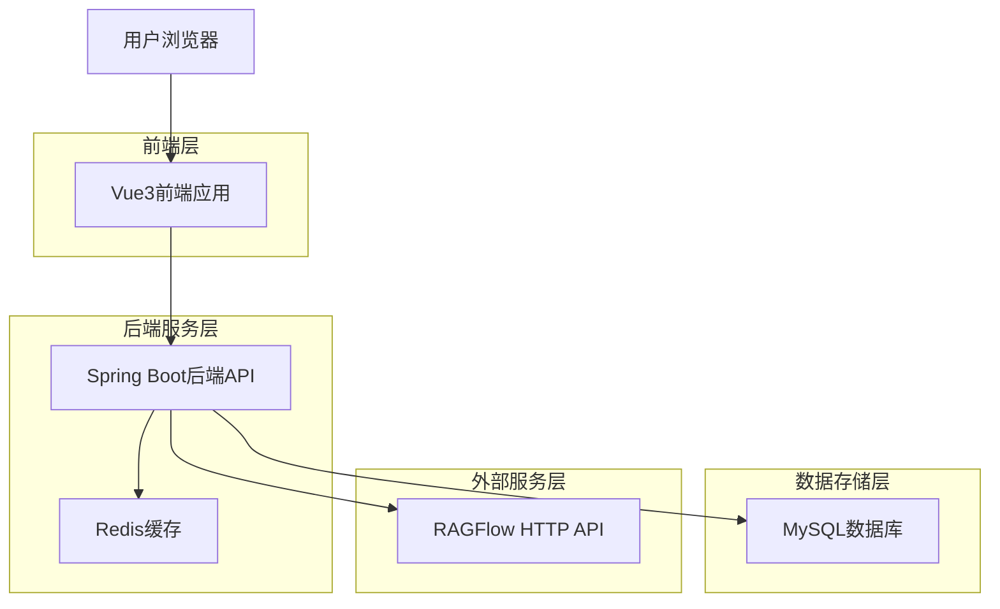
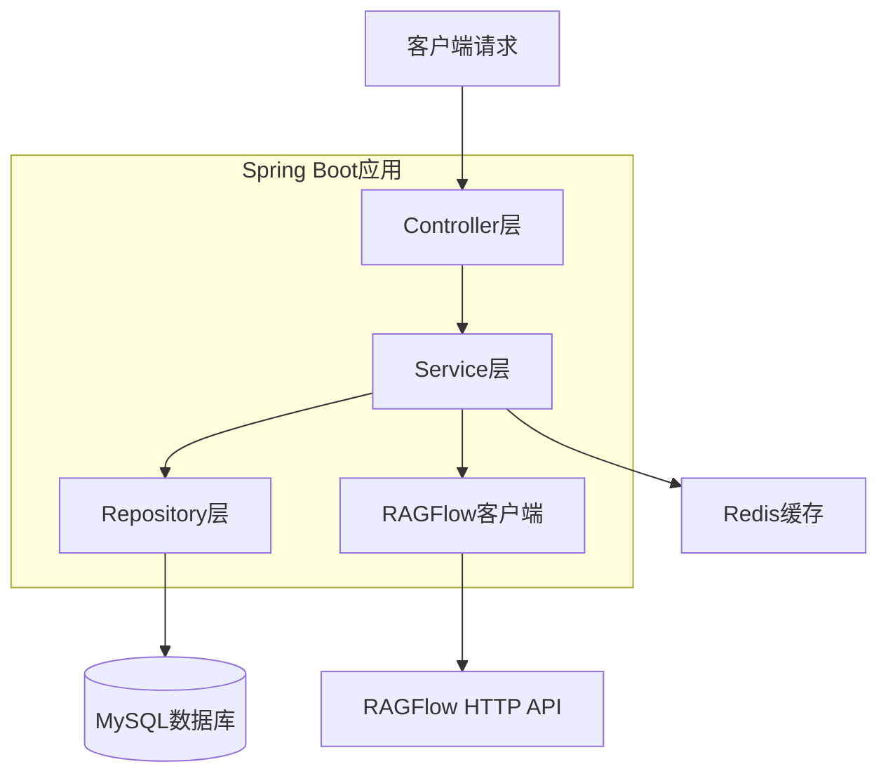
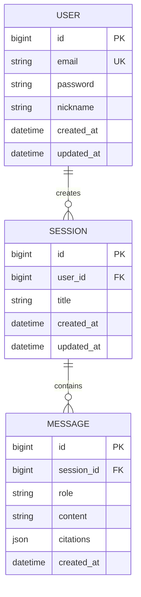

## 1. 架构设计



## 2. 技术栈描述

- **前端**: Vue3@3.4 + TypeScript@5.0 + Vite@5.0
- **前端UI**: Element Plus@2.4 + Tailwind CSS@3.4
- **初始化工具**: create-vue
- **后端**: Spring Boot@3.5 + JDK21 + Maven
- **数据库**: MySQL@8.0 + MyBatis-Plus@3.5
- **缓存**: Redis@7.0
- **消息推送**: WebSocket + Spring WebFlux

## 3. 路由定义

| 路由 | 用途 |
|------|------|
| / | 首页，展示产品特性和快速入口 |
| /chat | 对话页面，主要的AI交互界面 |
| /login | 登录页面，用户认证入口 |
| /register | 注册页面，新用户注册 |
| /sessions | 会话管理页面，历史会话列表 |
| /profile | 个人中心，用户信息管理 |

## 4. API定义

### 4.1 用户认证相关
```
POST /api/auth/login
```
请求参数：
| 参数名 | 参数类型 | 是否必需 | 描述 |
|--------|----------|----------|------|
| email | string | true | 用户邮箱 |
| password | string | true | 用户密码 |

响应参数：
| 参数名 | 参数类型 | 描述 |
|--------|----------|------|
| token | string | JWT令牌 |
| user | object | 用户信息 |

### 4.2 AI对话相关
```
POST /api/chat/send
```
请求参数：
| 参数名 | 参数类型 | 是否必需 | 描述 |
|--------|----------|----------|------|
| message | string | true | 用户消息 |
| sessionId | string | false | 会话ID，不传则创建新会话 |
| context | array | false | 上下文消息 |

响应参数：
| 参数名 | 参数类型 | 描述 |
|--------|----------|------|
| response | string | AI回复内容 |
| citations | array | 引用信息数组 |
| sessionId | string | 会话ID |

### 4.3 会话管理相关
```
GET /api/sessions/list
```
请求参数：
| 参数名 | 参数类型 | 是否必需 | 描述 |
|--------|----------|----------|------|
| page | number | false | 页码，默认1 |
| size | number | false | 每页条数，默认20 |

```
GET /api/sessions/{id}/messages
```
请求参数：
| 参数名 | 参数类型 | 是否必需 | 描述 |
|--------|----------|----------|------|
| id | string | true | 会话ID |

## 5. 服务端架构图



## 6. 数据模型

### 6.1 数据模型定义


### 6.2 数据定义语言

用户表（users）
```sql
CREATE TABLE users (
    id BIGINT PRIMARY KEY AUTO_INCREMENT,
    email VARCHAR(255) UNIQUE NOT NULL,
    password VARCHAR(255) NOT NULL,
    nickname VARCHAR(100) NOT NULL,
    created_at DATETIME DEFAULT CURRENT_TIMESTAMP,
    updated_at DATETIME DEFAULT CURRENT_TIMESTAMP ON UPDATE CURRENT_TIMESTAMP,
    INDEX idx_email (email)
);
```

会话表（sessions）
```sql
CREATE TABLE sessions (
    id BIGINT PRIMARY KEY AUTO_INCREMENT,
    user_id BIGINT NOT NULL,
    title VARCHAR(255) NOT NULL,
    created_at DATETIME DEFAULT CURRENT_TIMESTAMP,
    updated_at DATETIME DEFAULT CURRENT_TIMESTAMP ON UPDATE CURRENT_TIMESTAMP,
    FOREIGN KEY (user_id) REFERENCES users(id),
    INDEX idx_user_id (user_id),
    INDEX idx_created_at (created_at DESC)
);
```

消息表（messages）
```sql
CREATE TABLE messages (
    id BIGINT PRIMARY KEY AUTO_INCREMENT,
    session_id BIGINT NOT NULL,
    role VARCHAR(20) NOT NULL COMMENT 'user or assistant',
    content TEXT NOT NULL,
    citations JSON COMMENT '引用信息',
    created_at DATETIME DEFAULT CURRENT_TIMESTAMP,
    FOREIGN KEY (session_id) REFERENCES sessions(id),
    INDEX idx_session_id (session_id),
    INDEX idx_created_at (created_at)
);
```

### 6.3 核心配置

application.yml核心配置：
```yaml
spring:
  datasource:
    url: jdbc:mysql://localhost:3306/ragflow_chat?useSSL=false&serverTimezone=UTC
    username: ${DB_USERNAME:root}
    password: ${DB_PASSWORD:password}
  
  redis:
    host: ${REDIS_HOST:localhost}
    port: ${REDIS_PORT:6379}
    password: ${REDIS_PASSWORD:}

ragflow:
  api:
    base-url: ${RAGFLOW_API_URL:http://localhost:8080}
    api-key: ${RAGFLOW_API_KEY:your-api-key}
    timeout: 30000

websocket:
  endpoint: /ws/chat
  allowed-origins: "*"