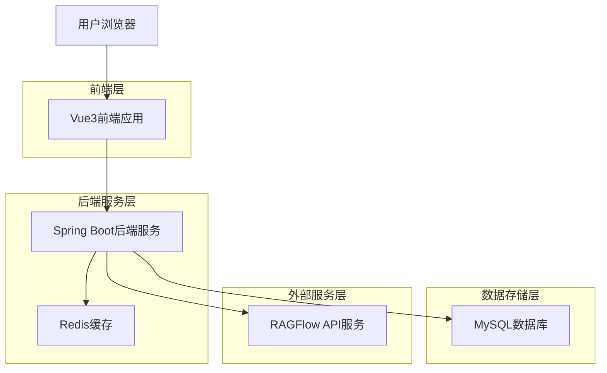
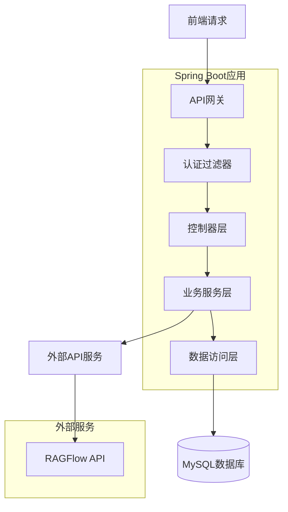
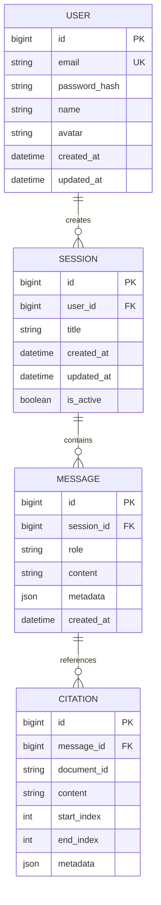

## 1. 架构设计



## 2. 技术描述

- **前端**: Vue3@3.4 + Vite@5 + TypeScript@5 + Element Plus@2
- **初始化工具**: Vite
- **后端**: Spring Boot@3.5 + JDK21 + Maven
- **数据库**: MySQL@8.0
- **缓存**: Redis@7.0
- **消息推送**: Server-Sent Events (SSE)
- **HTTP客户端**: Spring WebFlux WebClient
- **安全框架**: Spring Security + JWT

## 3. 路由定义

| 路由 | 用途 |
|------|------|
| / | 首页，展示产品介绍和快速入口 |
| /chat | 对话页面，主要的AI交互界面 |
| /login | 登录页面，用户身份验证 |
| /register | 注册页面，新用户注册 |
| /sessions | 会话管理页面，历史会话列表 |
| /profile | 个人中心，用户信息和管理 |
| /settings | 设置页面，个性化配置 |

## 4. API定义

### 4.1 用户认证API

**用户注册**
```
POST /api/auth/register
```

请求参数：
| 参数名 | 参数类型 | 是否必需 | 描述 |
|--------|----------|----------|------|
| email | string | true | 用户邮箱地址 |
| password | string | true | 密码（加密后传输） |
| name | string | true | 用户昵称 |

响应参数：
| 参数名 | 参数类型 | 描述 |
|--------|----------|------|
| success | boolean | 注册成功标识 |
| message | string | 提示信息 |
| token | string | JWT访问令牌 |

**用户登录**
```
POST /api/auth/login
```

请求参数：
| 参数名 | 参数类型 | 是否必需 | 描述 |
|--------|----------|----------|------|
| email | string | true | 用户邮箱地址 |
| password | string | true | 密码（加密后传输） |

### 4.2 对话API

**发送消息**
```
POST /api/chat/message
```

请求参数：
| 参数名 | 参数类型 | 是否必需 | 描述 |
|--------|----------|----------|------|
| sessionId | string | true | 会话ID |
| message | string | true | 用户输入的消息 |
| context | array | false | 上下文信息 |

**获取AI回复（SSE）**
```
GET /api/chat/stream/{sessionId}
```

**创建新会话**
```
POST /api/chat/session
```

**获取会话历史**
```
GET /api/chat/sessions
```

### 4.3 引用API

**获取引用详情**
```
GET /api/citation/{citationId}
```

响应参数：
| 参数名 | 参数类型 | 描述 |
|--------|----------|------|
| documentId | string | 文档ID |
| content | string | 引用原文内容 |
| highlight | string | 高亮显示的内容 |
| metadata | object | 文档元信息 |

## 5. 服务器架构图



## 6. 数据模型

### 6.1 数据模型定义



### 6.2 数据定义语言

**用户表 (users)**
```sql
CREATE TABLE users (
    id BIGINT PRIMARY KEY AUTO_INCREMENT,
    email VARCHAR(255) UNIQUE NOT NULL,
    password_hash VARCHAR(255) NOT NULL,
    name VARCHAR(100) NOT NULL,
    avatar VARCHAR(500),
    created_at DATETIME DEFAULT CURRENT_TIMESTAMP,
    updated_at DATETIME DEFAULT CURRENT_TIMESTAMP ON UPDATE CURRENT_TIMESTAMP,
    INDEX idx_email (email)
);
```

**会话表 (sessions)**
```sql
CREATE TABLE sessions (
    id BIGINT PRIMARY KEY AUTO_INCREMENT,
    user_id BIGINT NOT NULL,
    title VARCHAR(200) NOT NULL,
    created_at DATETIME DEFAULT CURRENT_TIMESTAMP,
    updated_at DATETIME DEFAULT CURRENT_TIMESTAMP ON UPDATE CURRENT_TIMESTAMP,
    is_active BOOLEAN DEFAULT TRUE,
    FOREIGN KEY (user_id) REFERENCES users(id) ON DELETE CASCADE,
    INDEX idx_user_id (user_id),
    INDEX idx_created_at (created_at DESC)
);
```

**消息表 (messages)**
```sql
CREATE TABLE messages (
    id BIGINT PRIMARY KEY AUTO_INCREMENT,
    session_id BIGINT NOT NULL,
    role VARCHAR(20) NOT NULL COMMENT 'user or assistant',
    content TEXT NOT NULL,
    metadata JSON,
    created_at DATETIME DEFAULT CURRENT_TIMESTAMP,
    FOREIGN KEY (session_id) REFERENCES sessions(id) ON DELETE CASCADE,
    INDEX idx_session_id (session_id),
    INDEX idx_created_at (created_at)
);
```

**引用表 (citations)**
```sql
CREATE TABLE citations (
    id BIGINT PRIMARY KEY AUTO_INCREMENT,
    message_id BIGINT NOT NULL,
    document_id VARCHAR(100) NOT NULL,
    content TEXT NOT NULL,
    start_index INT NOT NULL,
    end_index INT NOT NULL,
    metadata JSON,
    FOREIGN KEY (message_id) REFERENCES messages(id) ON DELETE CASCADE,
    INDEX idx_message_id (message_id),
    INDEX idx_document_id (document_id)
);
```

## 7. 核心服务设计

### 7.1 RAGFlow集成服务
- **WebClient配置**: 配置连接池和超时设置
- **请求封装**: 统一封装RAGFlow API请求
- **响应处理**: 解析AI回复和引用信息
- **错误处理**: 处理API异常和网络错误

### 7.2 实时消息服务
- **SSE实现**: 使用Spring WebFlux实现Server-Sent Events
- **消息队列**: 使用Redis发布订阅处理并发消息
- **连接管理**: 维护客户端连接状态和心跳检测

### 7.3 安全设计
- **JWT认证**: 基于Spring Security的JWT令牌认证
- **密码加密**: 使用BCrypt进行密码加密存储
- **CORS配置**: 配置跨域访问策略
- **限流控制**: 基于Redis的接口访问频率限制